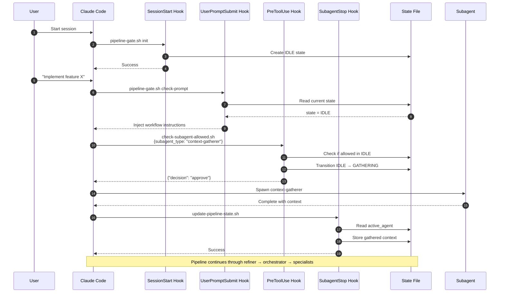
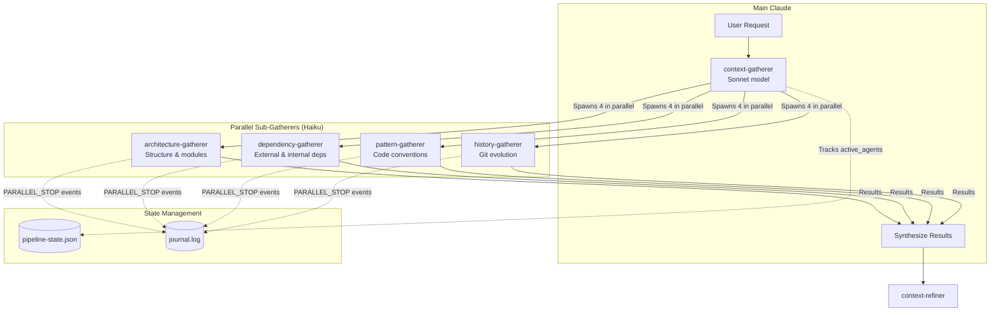
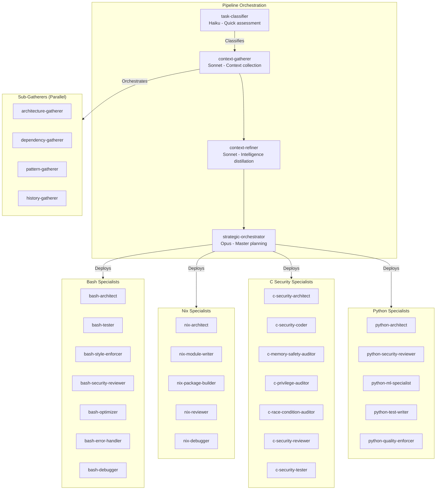
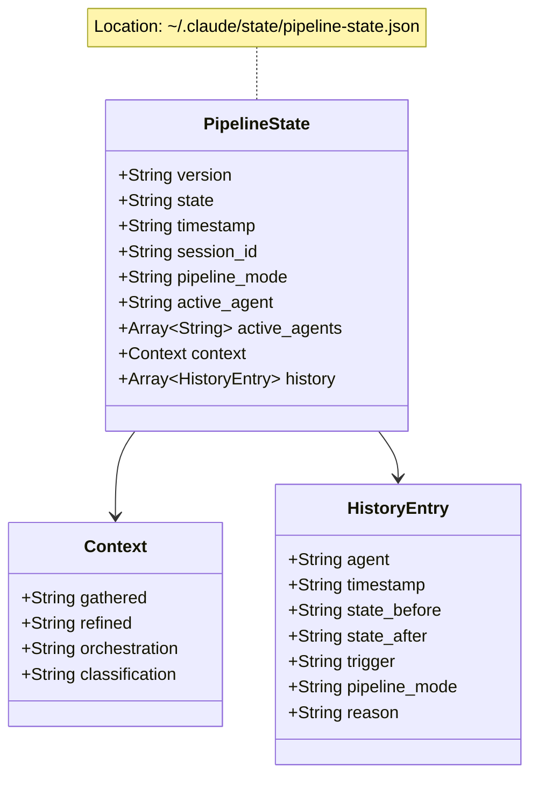
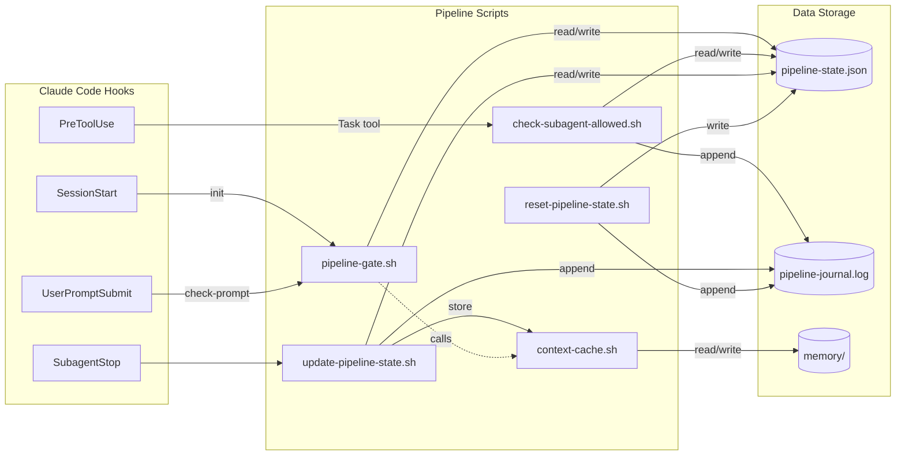
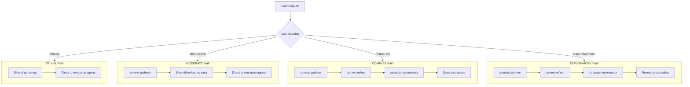
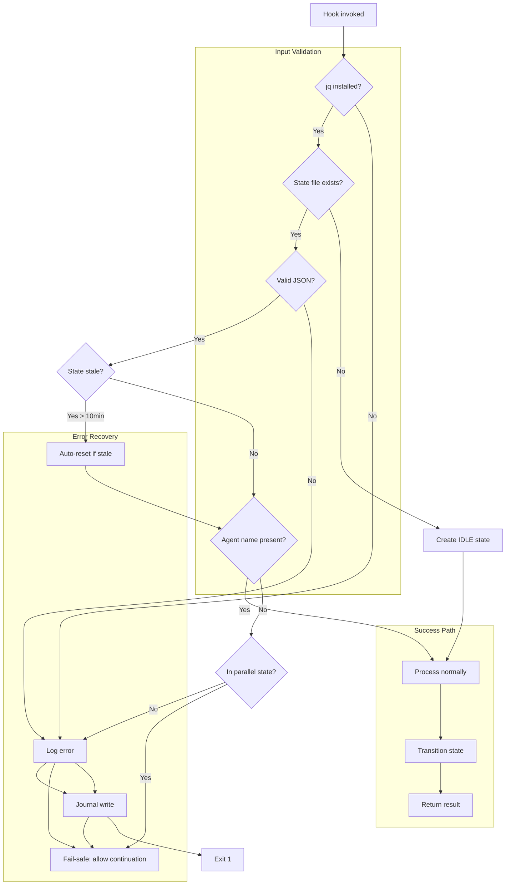
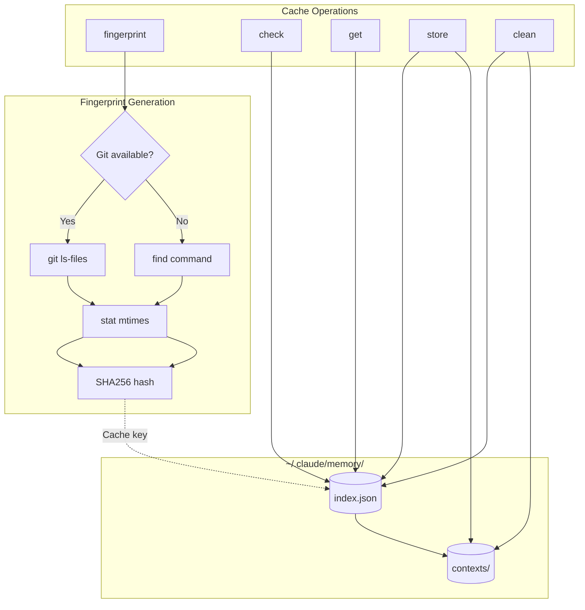
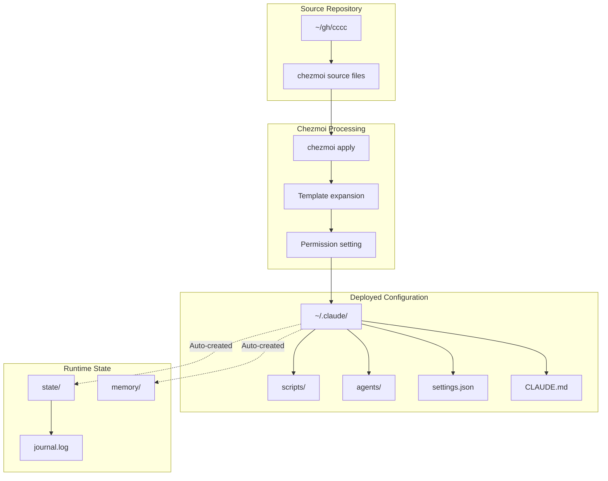

# CCCC Architecture Diagrams

Visual representations of the cccc agent pipeline system.

---

## 1. Complete FSM State Diagram

```mermaid
stateDiagram-v2
    direction TB

    [*] --> IDLE: SessionStart Hook

    state IDLE {
        note right of IDLE
            Allowed: task-classifier, context-gatherer
            Blocked: All other agents
        end note
    }

    IDLE --> CLASSIFIED: task-classifier completes
    IDLE --> GATHERING: context-gatherer approved<br/>(immediate transition)

    state CLASSIFIED {
        note right of CLASSIFIED
            Routes based on pipeline_mode:
            - TRIVIAL: execution agents
            - MODERATE/COMPLEX: context-gatherer
        end note
    }

    CLASSIFIED --> GATHERING: context-gatherer approved<br/>(MODERATE/COMPLEX/EXPLORATORY)
    CLASSIFIED --> EXECUTING: execution agent<br/>(TRIVIAL only)

    state GATHERING {
        note right of GATHERING
            Parallel sub-gatherers run here:
            - architecture-gatherer
            - dependency-gatherer
            - pattern-gatherer
            - history-gatherer
        end note
    }

    GATHERING --> REFINING: context-refiner approved<br/>(COMPLEX/EXPLORATORY)
    GATHERING --> EXECUTING: execution agent<br/>(MODERATE only)

    state REFINING {
        note right of REFINING
            Context distillation phase
            Allowed: strategic-orchestrator
        end note
    }

    REFINING --> ORCHESTRATING_ACTIVE: strategic-orchestrator approved<br/>(immediate transition)

    state ORCHESTRATING_ACTIVE {
        note right of ORCHESTRATING_ACTIVE
            Orchestrator running
            May deploy specialists
        end note
    }

    ORCHESTRATING_ACTIVE --> EXECUTING: strategic-orchestrator completes

    state EXECUTING {
        note right of EXECUTING
            Specialist agents run:
            bash-*, nix-*, c-*, python-*
            Stays in EXECUTING
        end note
    }

    EXECUTING --> EXECUTING: specialist agents loop

    EXECUTING --> COMPLETE: manual completion

    COMPLETE --> IDLE: reset
```

---

## 2. Hook Execution Flow



---

## 3. Parallel Context Gathering



---

## 4. Agent Hierarchy



---

## 5. State File Structure



---

## 6. Script Interaction Map



---

## 7. Adaptive Routing Decision Tree



---

## 8. Error Handling Flow



---

## 9. Context Cache Architecture



---

## 10. Deployment Architecture



---

## Legend

| Symbol | Meaning |
|--------|---------|
| `[Rectangle]` | Process/Action |
| `{Diamond}` | Decision |
| `[(Database)]` | Data storage |
| `-->` | Flow direction |
| `-.->` | Indirect/optional flow |
| `&` | Parallel operations |

---

*Generated for the cccc project - Claude Code Agent Pipeline*
