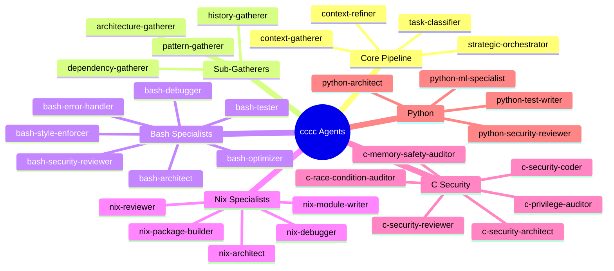

# CCCC Onboarding Guide

**Claude Code Agent Pipeline - A Complete Introduction**

This guide will help you understand and work with the cccc (Chezmoi Configs Claude Code) project, a sophisticated agent orchestration system for Claude Code.

---

## Table of Contents

1. [What is cccc?](#what-is-cccc)
2. [Core Concepts](#core-concepts)
3. [Architecture Overview](#architecture-overview)
4. [The Pipeline Flow](#the-pipeline-flow)
5. [Key Components](#key-components)
6. [Getting Started](#getting-started)
7. [Common Operations](#common-operations)
8. [Troubleshooting](#troubleshooting)

---

## What is cccc?

cccc is a **pipeline enforcement system** for Claude Code that ensures complex development tasks follow a structured workflow:

1. **Gather context** - Understand the codebase before making changes
2. **Refine intelligence** - Distill findings into actionable insights
3. **Plan strategically** - Coordinate the right specialists for the job
4. **Execute with expertise** - Deploy domain-specific agents

### Why Does This Exist?

Without guardrails, AI assistants can:
- Jump directly to implementation without understanding context
- Miss important patterns and conventions in the codebase
- Skip security considerations or best practices
- Produce inconsistent results across similar tasks

cccc **enforces discipline** by making it impossible to skip the context-gathering phases.

---

## Core Concepts

### Finite State Machine (FSM)

The pipeline is governed by a state machine that controls which agents can run:


### Pipeline Modes

Tasks are classified into four modes that determine the pipeline path:

| Mode | Description | Path |
|------|-------------|------|
| **TRIVIAL** | Simple single-file changes | Skip gathering → Execute directly |
| **MODERATE** | Focused changes | Gather → Execute (skip refiner) |
| **COMPLEX** | Multi-component changes | Full pipeline |
| **EXPLORATORY** | Research/understanding | Full pipeline |

### Agents

Agents are specialized Claude instances with focused expertise:



---

## Architecture Overview

### Directory Structure

```
~/.claude/                          # Deployed configuration
├── CLAUDE.md                       # Global runtime instructions
├── settings.json                   # Hook configuration
├── agents/                         # 50+ agent definitions
│   ├── context-gatherer.md
│   ├── bash-architect.md
│   └── ...
├── scripts/                        # Pipeline enforcement
│   ├── pipeline-gate.sh            # State initialization
│   ├── check-subagent-allowed.sh   # FSM enforcement
│   ├── update-pipeline-state.sh    # State transitions
│   ├── reset-pipeline-state.sh     # Manual recovery
│   └── context-cache.sh            # Persistent memory
├── state/                          # Runtime state (auto-created)
│   ├── pipeline-state.json         # Current FSM state
│   └── pipeline-journal.log        # Audit trail
└── memory/                         # Context cache
    ├── index.json
    └── contexts/
```

### Hook System


### Data Flow


---

## The Pipeline Flow

### Full Pipeline (COMPLEX Mode)


### State File Schema

```json
{
  "version": "1.0",
  "state": "GATHERING",
  "timestamp": "2025-11-29T08:00:00Z",
  "pipeline_mode": "COMPLEX",
  "active_agent": "context-gatherer",
  "active_agents": ["context-gatherer"],
  "context": {
    "gathered": "Raw context from gatherer...",
    "refined": "Distilled intelligence...",
    "orchestration": "Strategic plan..."
  },
  "history": [
    {
      "agent": "context-gatherer",
      "timestamp": "2025-11-29T08:00:00Z",
      "state_before": "IDLE",
      "state_after": "GATHERING",
      "trigger": "immediate_on_approval"
    }
  ]
}
```

---

## Key Components

### 1. pipeline-gate.sh

**Purpose**: Initialize state and inject workflow instructions

**Called by**:
- `SessionStart` hook with `init` argument
- `UserPromptSubmit` hook with `check-prompt` argument

**Key functions**:
- `initialize_state()` - Creates fresh IDLE state
- `check_prompt()` - Injects workflow guidance if in IDLE

### 2. check-subagent-allowed.sh

**Purpose**: Enforce FSM state machine, approve/block agents

**Called by**: `PreToolUse` hook (Task tool only)

**Exit codes**:
- `0` - Agent approved
- `1` - Error
- `2` - Agent blocked (policy violation)

**Key logic**:
```
IDLE:        Only context-gatherer or task-classifier
CLASSIFIED:  Depends on pipeline_mode
GATHERING:   Only context-refiner (COMPLEX) or execution (MODERATE)
REFINING:    Only strategic-orchestrator
EXECUTING:   Only language specialists
```

### 3. update-pipeline-state.sh

**Purpose**: Advance state after agent completion, store context

**Called by**: `SubagentStop` hook

**Key functions**:
- `determine_next_state()` - FSM transition logic
- `extract_context_from_agent()` - Parse agent output
- `remove_completed_agent()` - Clean up tracking array

### 4. context-cache.sh

**Purpose**: Persistent context memory across sessions

**Commands**:
```bash
context-cache.sh fingerprint [path]  # Generate codebase hash
context-cache.sh check [path]        # Check cache hit
context-cache.sh get [path]          # Retrieve cached context
context-cache.sh store [path]        # Store new context (stdin)
context-cache.sh clean [days]        # Remove old entries
```

**Storage**: `~/.claude/memory/` with 7-day TTL

---

## Getting Started

### Prerequisites

```bash
# Required
jq --version    # JSON processing (1.6+)
bash --version  # Shell (4.0+)

# Optional
git --version   # For fingerprinting
```

### Installation

```bash
# Clone the repository
git clone https://github.com/youruser/cccc ~/gh/cccc
cd ~/gh/cccc

# Deploy with chezmoi
chezmoi apply

# Verify installation
~/.claude/scripts/verify-installation.sh
```

### Your First Pipeline Run

1. **Start a Claude Code session**

2. **Ask for a complex task**:
   ```
   "Help me implement a new feature that adds caching to the API endpoints"
   ```

3. **The pipeline activates**:
   - Hook injects workflow instructions
   - You're prompted to use `task-classifier` or `context-gatherer`

4. **Follow the flow**:
   ```
   context-gatherer → context-refiner → strategic-orchestrator → specialists
   ```

---

## Common Operations

### Check Current State

```bash
# View current state
jq '.state' ~/.claude/state/pipeline-state.json

# View full state with history
jq . ~/.claude/state/pipeline-state.json

# View recent journal entries
tail -20 ~/.claude/state/pipeline-journal.log
```

### Reset Pipeline

```bash
# Manual reset (when stuck)
~/.claude/scripts/reset-pipeline-state.sh "Reason for reset"

# Or use slash command in Claude Code
/pipeline-reset
```

### View Context Cache

```bash
# Check cache statistics
~/.claude/scripts/context-cache.sh info

# Clear old entries
~/.claude/scripts/context-cache.sh clean 7
```

### Invoke the Pipeline

```
# Option A: Quick classification first
Use task-classifier to assess complexity, then route appropriately

# Option B: Full pipeline
Use context-gatherer to start comprehensive analysis
```

---

## Troubleshooting

### "Agent blocked" Error

**Symptom**: `Must start pipeline with context-gatherer`

**Cause**: Trying to use a specialist agent before gathering context

**Solution**:
1. Reset pipeline: `~/.claude/scripts/reset-pipeline-state.sh "Reset"`
2. Start with `context-gatherer` or `task-classifier`

### Stale State

**Symptom**: Pipeline seems stuck, state is old

**Cause**: State file older than 10 minutes without progress

**Solution**: Auto-reset triggers, or manually reset

### Pipeline Mode Not Set

**Symptom**: `Pipeline mode not set` error after classification

**Cause**: task-classifier completed but mode wasn't extracted

**Solution**: Manually set mode:
```bash
jq '.pipeline_mode = "COMPLEX"' ~/.claude/state/pipeline-state.json > /tmp/state.json
mv /tmp/state.json ~/.claude/state/pipeline-state.json
```

### Journal Shows Errors

**Location**: `~/.claude/state/pipeline-journal.log`

**Common entries**:
- `APPROVE` - Agent was allowed
- `BLOCK` - Agent was denied (with reason)
- `TRANSITION` - State changed
- `ERROR` - Something went wrong
- `PARALLEL_STOP` - Parallel agent completed

---

## Quick Reference

### FSM States

| State | Allowed Agents |
|-------|----------------|
| IDLE | context-gatherer, task-classifier |
| CLASSIFIED | Depends on mode |
| GATHERING | context-refiner (or execution for MODERATE) |
| REFINING | strategic-orchestrator |
| ORCHESTRATING_ACTIVE | Language specialists |
| EXECUTING | Language specialists |
| COMPLETE | context-gatherer (restart) |

### Agent Categories

| Category | Agents | Model |
|----------|--------|-------|
| Classification | task-classifier | haiku |
| Core Pipeline | context-gatherer, context-refiner | sonnet |
| Orchestration | strategic-orchestrator | opus |
| Sub-Gatherers | architecture, dependency, pattern, history | haiku |
| Bash | architect, tester, style-enforcer, security, optimizer, error-handler, debugger | sonnet |
| Nix | architect, module-writer, package-builder, reviewer, debugger | sonnet |
| C Security | architect, coder, memory-auditor, privilege-auditor, race-auditor, reviewer, tester | sonnet |
| Python | architect, security-reviewer, ml-specialist, test-writer, quality-enforcer | sonnet |

### Key Files

| File | Purpose |
|------|---------|
| `~/.claude/state/pipeline-state.json` | Current FSM state |
| `~/.claude/state/pipeline-journal.log` | Audit trail |
| `~/.claude/CLAUDE.md` | Runtime instructions |
| `~/.claude/settings.json` | Hook configuration |

---

## Next Steps

1. **Read the Architecture Doc**: `~/.claude/scripts/ARCHITECTURE.md`
2. **Explore Agent Definitions**: `~/.claude/agents/`
3. **Try Different Modes**: Experiment with TRIVIAL vs COMPLEX tasks
4. **Customize Agents**: Create your own specialists for your domain

---

*Generated for the cccc project - Claude Code Agent Pipeline*
